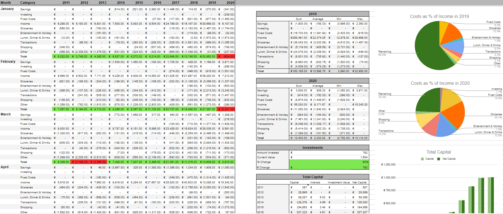

# Personal Finance
The purpose of this application to easily track your personal finance by giving the script a set of keywords.
As daily life usually has quite a lot of similar transactions (groceries, shopping, eating out etc.)
you can create a complete overview of your spending pattern rather quickly.

## Set-Up / Installation
1. Copy the spreadsheet template you can find [here](
https://docs.google.com/spreadsheets/d/183sUTSwVHJ600WKz7DN-OzPW8FxVmDkVkNy6M_GFZsQ/edit?usp=sharing).
2. Connect a Spreadsheet to gspread, follow [this guide](
https://towardsdatascience.com/accessing-google-spreadsheet-data-using-python-90a5bc214fd2) until "Reading
spreadsheet data with Python". Don't forget to also include the Google Sheets API which is not mentioned in
the article.
3. Download **personal_finance.py** and set the parameters in the "personal_finance" function to the right spreadsheet
and sheets. If you use my template, these are already correct if you change the name of the spreadsheet to "Finances".
Also, don't forget to add the "client_secret.json" file to the same folder.
3. Download your transaction data as csv (for example: *NLXXINGBXXXXXXXXXX_01-01-2011_02-07-2020.csv*)
    - Currently the only working bank is [ING](https://www.ing.nl/). If you want to make it work with your bank,
    please send me a file with the format your bank uses so I can include it as an option.
4. Run **personal_finance.py** and checkout the result.